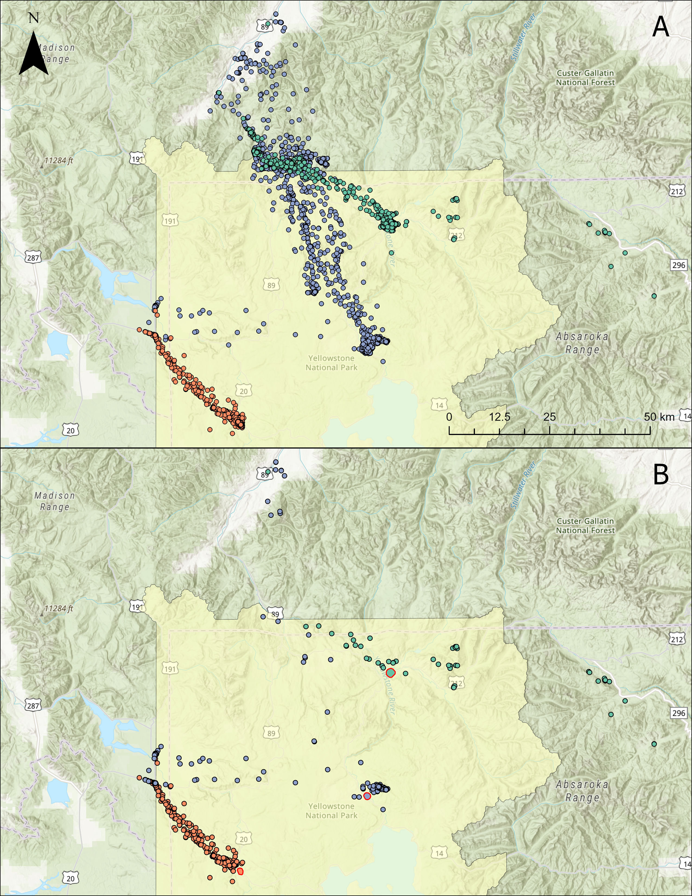
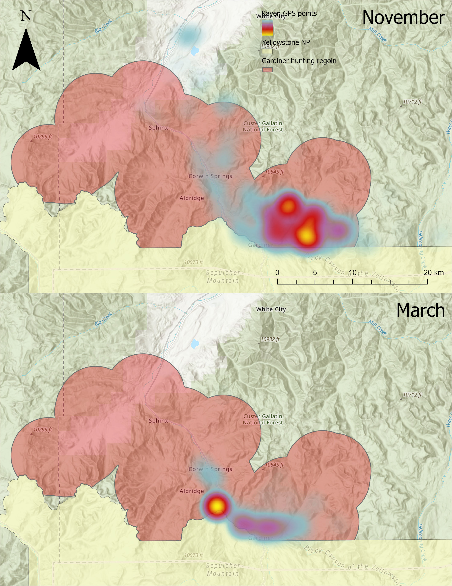
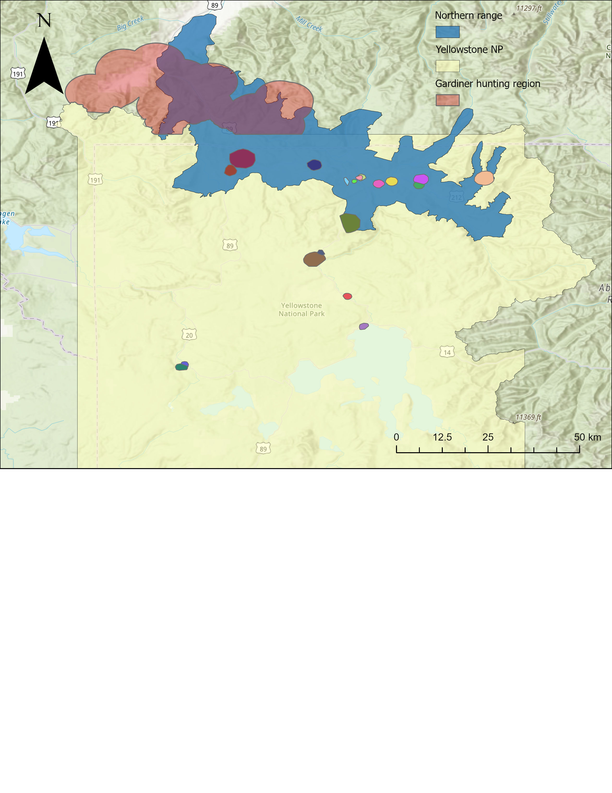

```{r setup, include=FALSE}
knitr::opts_chunk$set(echo = TRUE)
library(here)
library(readr)
library(dplyr)
library(lme4)
library(tidyr)
library(myFunctions) #custom bootstrap function
library(ggplot2)

#optimizer for glmer
cntrl <- glmerControl(optimizer = "bobyqa", tol = 1e-4, optCtrl=list(maxfun=100000))

```


# Modeling
I am using a conditional binomial model to determine what factors impact movement decisions of territorial common ravens during the winter in Yellowstone. I will look at if various predictors impact if a raven decided to leaves its territory, and if it did, if it visit the Gardiner hunting region or not. The largest predictors here revolve around food availability of carrion created by human hunting activity and wolves.  
<br>
There are two data sets, one for each part of the conditional model. The first one includes all of the days during the Yellowstone Wolf Project winter study periods (Nov 15- Dec 15 & Mar 1 - Mar 30) because my main predictor is the presence of wolf kills within a ravens territory and the carcass data is most reliable for that period of time due to GPS collar fix rates.  
The second data set includes all winter from the start of the hunting season (varies by year, but always in the last week of October) to the end of March (end of late winter study). I can include these other periods because I am no longer considering wolf kills as a predictor because the raven at this point in the conditional model has already decided to leave its territory. This also allows me to have more data on days with low or no hunter gutpile availability from January and February.  
For both data sets, all data points are excluded if that raven had less than 5 GPS points and the movement decisions was the negative for that binomial model (didn't leaves its territory or didn't visit the hunting area).
```{r reading in data, results = 'hide', message = FALSE}
## dataset for part 1 of conditional model
ws_model_data <- read_csv(here("data", "clean", "commute_data.csv")) %>% 
  
  #restricting to only winter study months
  filter((paste(month, day, sep = "-") >= "11-15" &
            paste(month, day, sep = "-") <= "12-15") |
          (paste(month, day, sep = "-") >= "3-1" &
            paste(month, day, sep = "-") <= "3-30")) %>% 
  
  #removing days when there is less than 5 GPS point
  #unless the result is Jardine
  filter(!(n_point < 5 & terr_bin == F)) %>% 
  
  #only columns used in model
  dplyr::select(terr_bin, raven_id, rf_active_kill, bms_window_1, hunt_season, take_high_low, rf_avg_terr_kill_density, dist2nentrance,
                study_period, temp_max, snow_depth, prop_group_left_terr) %>% 
  
  #making sure rows are complete
  filter(complete.cases(.)) 
  

## dataset for part 2 of conditional model
hunt_model_data <- read_csv(here("data", "clean", "commute_data.csv")) %>%

  #only have days ravens decided to leave territory
  filter(terr_bin == 1) %>% 
  
  #removing days when there is less than 5 GPS point
  #unless the result is Jardine
  filter(!(n_point < 5 & hunt_bin == F)) %>% 
  
  
  #only columns used in model
  dplyr::select(hunt_bin, raven_id, bms_window_1, hunt_season, take_high_low, dist2nentrance, study_period, temp_max, snow_depth, prop_group_visit_hunt) %>% 
  
  #making sure rows are complete
  filter(complete.cases(.)) 
```
Here is a description of all the model covariates
- rf_active_kill: if a kill detected through the RF predictive model is present on the ravens territory or not
- bms_window_1: the estimated available biomass from human hunting
- hunt_season: if it is currently within the hunting season or not
- take_high_low: a categorical value for if human hunting take was high (>1), low (<1), or 0
- rf_avg_terr_kill_density: the average number of kills per 30 days during early or late winter study period
- dist2nentrance: distance from raven territory to the north entrance station
- study_period: early or late winter study
- temp_max: daily maximum temperature
- snow_depth: daily snow depth
prop_group_left_terr: the proportion of other ravens that left their territory
prop_group_visit_hunt: the proportion of other ravens that visited the Gardiner hunting region
## Part 1 of conditional model
The first part of the conditional model predicts if a raven will leaves it territory or not.  
<br>
DEPENDENT VARIABLE  
terr_bin  
1 = left territory  
0 = stayed on territory  
<br>
I ended up trying a three different covariates to represent the hunting element of the model because I don't know how ravens view the resource or the thresholds for availability that they consider viable. For examples,  10 and 15 kills are probably basically the same thing. Its a lot of potential food. But where is that line drawn. Is 1 and 5 different enough? What about 5 and 10? Or maybe 1 is all it takes. Or just hunters trying. It also allows for a little flexibility without the most precise daily data for hunting.  
After talking with John, I am probably going to report both the hunting season model (2) and the biomass model (1). This is because the biomass covariate has so much uncertainty in how it is calculated during the MTFWP season since it doesn't actually quantify the number of daily kills. It tries to account for variation by using elk movement. It is very possible that someone doesn't like or believe it is calculated correctly. By also including the hunting season model we can show that the overall hunting period itself, regardless of the daily biomass availability, has an effect on decision making. Then, we can say that we tried to get finer scaled using the biomass covariate. The results are similar enough that it is believable and doesn't drastically change interpretation, but a reader can disregard that part if they want. 
<br>
1. bms_window: The most specific is the a measure of the available biomass.
```{r (1) bms_window model}
mod_terr_bms1 <- glmer(terr_bin ~ (1|raven_id) + rf_active_kill * scale(bms_window_1) + scale(rf_avg_terr_kill_density) + 
                         scale(dist2nentrance) + study_period * scale(temp_max) + scale(snow_depth) + scale(prop_group_left_terr),
                       data = ws_model_data,
                       family = "binomial",
                       nAGQ = 40,
                       control = cntrl)
summary(mod_terr_bms1)
```
2. hunt_season: The least specific is just whether it is within the hunting season
```{r (1) hunting season model}
mod_terr_hseason <- glmer(terr_bin ~ (1|raven_id) + rf_active_kill * hunt_season + scale(rf_avg_terr_kill_density) + 
                            scale(dist2nentrance) + study_period * scale(temp_max) + scale(snow_depth) + scale(prop_group_left_terr),
                         data = ws_model_data,
                         family = "binomial",
                         nAGQ = 40,
                         control = cntrl)
summary(mod_terr_hseason)
```
3. take_high_low: in between the other 2, its a categorical variable with either high, low, or zero biomass availability.
```{r (1) categorical take model, message=FALSE}
mod_terr_hl <- glmer(terr_bin ~ (1|raven_id) + rf_active_kill * take_high_low + scale(rf_avg_terr_kill_density) + 
                            scale(dist2nentrance) + study_period  * scale(temp_max) + scale(snow_depth) + scale(prop_group_left_terr),
                     data = ws_model_data,
                     family = "binomial",
                     nAGQ = 40,
                     control = cntrl)
summary(mod_terr_hl)
```
All 3 models are pretty competitive.
```{r (1) comparing hunting covariate models}
AIC(mod_terr_bms1) #equally good
AIC(mod_terr_hseason) #equally good
AIC(mod_terr_hl)
```
It actually didn't matter which hunting covariate I used because they were all not significant. Instead, as expected, in most of the models the presence of an active kill within 1 km of a ravens territory lead to less chance of the raven leaving its territory. The interaction term in all 3 models was not significant, meaning that the presence of an active kill did not change the impact hunter gutpile availability had on raven movement.  
The binary hunting season covariate in the second model did lead to a change in the significance of the active kill covariate. This is because the added interaction term (with active wolf kill) had a high standard error, even though the effect size and direction were basically the same.  
The average kill density in a ravens territory did not impact movement decisions. So they don't consider the past or prior knowledge of their territory and are only responding to more immediate stimuli. This makes sense when considering that a high productivity territory is still unlikely to have a kill made each day. Then their response to no immediate kills in their territory is to leave, which is still a gamble since you don't know what the food situation will be like in Gardiner or elsewhere; however, in most cases those human sites will still be less of a gamble than a raven in a high productivity territory.  
The study period being early or late winter has a negative effect in the late winter in all 3 of the models (even though it isn't significant in model 3), which follows my prediction about how pre-breeding behaviors would impact raven movement by keeping them on territory more often.  
The maximum daily temperature had a negative effect in all three models, although it was borderline in 2 of the models. Higher temperatures lowered the chance of a raven leaving its territory. A good reason for this might be that the colder days require more energy to maintain body temperature, so a more guaranteed food sources is taken. Then on warmer days when temperature regulation is easier, they don't risk as much by staying on their territory. An interaction between temperature and study period was tested to tell if ravens were influenced by temperature differently at different times of year and the effect was insignificant and is not included here.  
Snow depth had the same effect found from the Walker et al. study that greater snow depth increased the chances of the raven being in anthropogenic hunting areas (leaving their territory). This isn't a perfect conclusion though because even though they leave their territory, they could still be staying in the national park. However, it does agree with the alternative logic that higher snow depth leads to ungulate migration and more potential hunting availability. So this might be a cue that they are not following or attempting to gain knowledge about actual hunting availability (hence a lack of effect for the actual hunting covariate) and are instead following proxies for it. snow depth and the hunting biomass coavriates have a high correlation in the model output. This is likely because the biomass calculation takes into account elk migration timing, which is heavily influenced by snow depth.  
One super interesting thing to note is that I ran this model with the group travel covariate before adding the temperature, and the group travel stopped being significant after the addition of the temperature. So it would seem like they don't take into account the other ravens that much and instead are all responding to the same stimuli.  
Here is the bootstrapped parameter confidence intervals for model 1 using the biomass estimate as the hunting covariate. 
```{r (1) bootstrap, echo=FALSE, warning=FALSE}
#bootstrapping parameter values from model simulations
boot_param_CI(nsim = 1000, model = mod_terr_bms1, data = ws_model_data)[[3]]
```

## Part 2 of conditional model
The second part of the conditional model predicts if, when a raven left its territory, if it visited the Gardiner hunting region.  
<br>
DEPENDENT VARIABLE  
hunt_bin  
1 = visited hunting  
0 = visited other place  
<br>
Again, I compared models using the same three hunting covariates. However, this time I removed the wolf kill and study period covariates.  
I don't consider wolf kills anymore because, at this point in the model, the raven has already left its territory. It is true that a raven could travel to a wolf kill outside of its territory, but I am interested in the decision to travel to the Gardiner hunting region, so those other options don't matter as much. That includes other cities and towns. This part of the conditional model acknowledges their presence, but isn't really interested in them specifically.  
I don't consider study period anymore because, again, in this part of the conditional model the raven has already decided to leave its territory. The breeding behavior hypothesis was that ravens would want to **stay on their territory** more during late winter to perform breeding behaviors. This doesn't matter anymore here.  
<br>
1. bms_window: The most specific is the a measure of the available biomass.
```{r (2) bms_window model}
mod_hunt_bms1 <- glmer(hunt_bin ~ (1|raven_id) + scale(bms_window_1) + scale(dist2nentrance) + 
                         scale(prop_group_visit_hunt) + scale(temp_max) + scale(snow_depth),
                       data = hunt_model_data,
                       family = "binomial",
                       nAGQ = 40,
                       control = cntrl)
summary(mod_hunt_bms1)
```
2. hunt_season: The least specific is just whether it is within the hunting season
```{r (2) hunting season model}
mod_hunt_hseason <- glmer(hunt_bin ~ (1|raven_id) + hunt_season + scale(dist2nentrance) + 
                            scale(prop_group_visit_hunt) + scale(temp_max) + scale(snow_depth),
                          data = hunt_model_data,
                          family = "binomial",
                          nAGQ = 40,
                          control = cntrl)
summary(mod_hunt_hseason)
```
3. take_high_low: in between the other 2, its a categorical variable with either high, low, or zero biomass availability.
```{r (2) categorical take model}
mod_hunt_hl <- glmer(hunt_bin ~ (1|raven_id) + take_high_low + scale(dist2nentrance) + 
                            scale(prop_group_visit_hunt) + scale(temp_max) + scale(snow_depth),
                     data = hunt_model_data,
                     family = "binomial",                       
                     nAGQ = 40,
                     control = cntrl)
summary(mod_hunt_hl)
```
Of the 3 models, the hunting season and high/low hunting predictors are equal.
```{r (2) comparing hunting covariate models}
AIC(mod_hunt_bms1)
AIC(mod_hunt_hseason) #equally good
AIC(mod_hunt_hl) #equally good
```
In all of the models the hunting covariate was significant and followed the trend of more hunting, more likely the raven is to visit the hunting area.  
The distance to the hunting area was also always significant with ravens holding territories closer to the hunting area visiting more frequently. Makes sense that the less time and energy it takes to get there makes it more worth checking out the area. For some ravens that are really close, it also gives them the advantage of potentially being able to hear gunshots that indicate potential hunter success.    
The proportion of other ravens that are visiting the hunting area has a positive effect. When considered in conjunction with the effect of the group covariate in part 1 of the conditional model: ravens aren't influenced by other ravens when deciding to leave their territory; however, if they do choose to leave they are often visiting the same destinations as the rest of the ravens that leave their territories. So if they choose to leave, which is a decision based on abiotic factors like weather and available local food, they are utilizing social cues and shared information.  
The maximum daily temperature had a negative effect in all three models, lowering the chance of a raven visiting the hunting area if it decided to leave its territory during warmer weather.  
The effect of snow depth is uncertain from these models. Only model 1 found a significant effect and the other two models were not significant with different effect directions (although both almost 0).  
Here is the bootstrapped parameter confidence intervals for model 1 using the biomass estimate as the hunting covariate. 
```{r (2) bootstrap, echo=FALSE, warning=FALSE}
#bootstrapping parameter values from model simulations
boot_param_CI(nsim = 1000, model = mod_hunt_bms1, data = hunt_model_data)[[3]]
```

## Figures
Here is a table that shows the number of times raven made each decision. Beth had the idea to make some kind of heat map similar to the map below that has individual examples of ravens GPS points, but for raven decisions. This would be so there was some, more easily understandable (the giant mass of GPS points is hard to comprehend and compare), visual example. The Gardiner hunting region and the territory would be heat map areas and then the times that the raven left its territory but didn't go to Gardiner would leave the GPS points like map 1.B. This would mean that you could only have 1 raven per map so that the heat map reflected that individuals decisions.
```{r table of raven decisions, message=FALSE}
(raven_decisions <- read_csv(here("data",  "clean", "commute_data.csv")) %>%
   group_by(raven_id) %>% 
   summarize(terr = sum(terr_bin == FALSE),
             other = sum(terr_bin == TRUE & hunt_bin == FALSE),
             hunt = sum(hunt_bin == TRUE)) %>% 
  # adding column for total sample size for each raven
   mutate(n = hunt + other + terr))
```
But I think an even better option would be a bar chart with 3 levels showing the proportion of days making whatever decisions (similar to how we handled the raven foraging).  
```{r bar plot of raven decisions, echo=FALSE}
raven_decisions %>% 
  # switching to long format
  pivot_longer(cols = c(hunt, other, terr),
               names_to = "decision") %>% 
  # setting graphing data
  ggplot(aes(x = value, y = raven_id, fill = decision)) +
  # creating proportion stacked barplot
  geom_bar(position = "fill", stat = "identity",
           colour = "black", linewidth = 0.2) +
  # changing labels of plot
  labs(title = "Raven movement decisions",
       x = "Proportion",
       y = "Raven ID",
       fill = "Movement\ndecision") +
  # custom color scheme
  scale_fill_manual(values = c(terr = "#e7e1ef", 
                               other = "#c994c7", 
                               hunt = "#dd1c77"),
                    # changing name of legend items
                    labels = c("hunting", "other", "territory")) +
  # removing space between axis and barplot
  scale_x_continuous(expand = c(0, 0)) +
  # adding sample size to right axis
  geom_text(data = raven_decisions, aes(x = 1.01, y = raven_id, label = n),
            inherit.aes = FALSE, hjust = 0, size = 3) + 
  # adding label for sample size column
  annotate("text", x = 1, y = Inf, label = "Sample size",
    hjust = 0, vjust = -0.3, size = 3) +
  # adjusting plot axis to show the extra text
    coord_cartesian(xlim = c(0, 1.1), clip = "off") +
  theme_classic()

```
<br>
Here is an visual example of three different ravens with territories at different distances from the Gardiner hunting region area and their GPS points.  
Of the three ravens, the orange raven with its territory at Old Faithful is the only one that doesn't visit the hunting area which is why it looks the same in both maps. Instead, its trips are consistently to the closer town of West Yellowstone, presumably to feed on human refuse. It probably makes this decision because the time investment to travel up to the Gardiner hunting region is not worth it when an alternative location with consistent foraging is nearby.  
Even though purple is a similar distance to West Yellowstone where orange visits frequently, it  chooses to travel to the north instead. It probably makes this choice because unlike orange, the time investment is about the same between the two locations. And Gardiner has a much higher level of hunting offering a potentially better foraging opportunity while also have human refuse as a back up. Almost all trips north for purple resulted in a visit to the Gardiner hunting region, and the few remaining points up north are probably because of a missed fix in the hunting area. Most of the time when the purple chooses to leave its territory, but not visit the Gardiner hunting region, it is actually still hanging out around its territory but just outside of the 1 kilometer around the 90% minimum convex polygon I am currently considering their territory.  
Green's territory is so close to the Gardiner hunting region that it only makes sense that it visits so often, given that the flight time for that trip is less than 30 minutes. On days that it leaves its territory but does not visit the Gardiner hunting region it visits various areas in the northern range inside the park and even ventures eastward a few times during October before it gets too cold.  
One super interesting thing to note is that you would think that there would be more obvious instances of ravens visiting wolf kills outside their territories which would show up as small concentrations of GPS points in map B. However, this almost never occurs, or at least isn't obvious. I think this is because either the carcass is close enough to their territory that I still consider the raven as having not left. Or, ravens will frequently visit wolf kills outside their territory, followed by a trip to the Gardiner hunting area. This second explanation actually lines up with some of my experiences seeing a group of ravens fly into a carcass sometime in the morning, only to leave not long after. I look into this a farther down using some tables.  
Map A shows the all GPS points made by each of the three ravens. Map B shows the GPS points for the three ravens when they choose to exit their territories (highlighted in red), but did not visit the Gardiner hunting region.
  

<br>
Here is a heat map of the raven GPS points outside the park from November and March along with a polygon denoting the area used to determine if a raven attempted to search for hunter created resources during the MTFWP rifle hunting season and the tribal bison hunt (hereafter Gardiner hunting region). The Gardiner hunting region is defined as the space 5 km from all roads within 10 km north of the national park boundary. This space has a high density of hunting activity in close proximity to the northern range of the park. The 5 km buffer around roads was used as a reasonable distance for a hunter to travel. There is certainly successful hunting attempts in the areas outside this polygon, but the relative number of those will be low compared to hunting within the polygon.  
This polygon does include the town of Gardiner along with the local landfill and water treatment ponds that ravens have been documented using as locations to forage since I made the assumption that a dominant territorial raven visiting this area would always attempt to find hunter offal, even if unsuccessful. 26% of trips to the Gardiner hunting region during the hunting season resulted in at least 1 GPS point at the landfill and water treatment pond.  

<br>
Here is a map of the relevant polygons used including the study area of Yellowstone National Park, the northern range of Yellowstone, and raven territories calculated using 90% minimum convex polygons of their breeding season GPS data. All raven used for this study have territories within the boundary of the national park. In 2 cases where a territorial pair had both individuals GPS tagged, only the female was used since the GPS fix rate was higher due to better battery levels resulting from less coverage of the solar panel during the winter.  

## Wolf kill visits
I looked at how often ravens were visiting wolf kills when they left their territory because it looked like they didn't visit kills that often when they left their territory but didn't visit the Gardiner hunting region (map 1.B). This currently includes both the RF predicted wolf kills and the wolf project kill database to have the maximum coverage of possible kills. 
```{r wolf kill visits off territory, message=FALSE}
source(here("scripts", "exploratory", "wolf_kill_visits.R"))

# table for days visiting wolf kills with no hunting visit
leave_no_hunt_wolf_kills

# table for days visiting wolf kills with hunting visit
hunt_wolf_kills

```
It looks like wolf kill visits are not a large portion of trips outside of the territory, regardless of if the raven ends up in the Gardiner hunting region or not. Although it is more than map 1.B makes it look like. This might be because they don't actually spend a lot of time at these kills, so they don't accumulate GPS points there.  
This tracks with the foraging paper and the relative importance of natural carrion compared to anthropogenic resources used by most ravens. It is worth noting that a fair number of times ravens do visit wolf kills before preceding to the Gardiner hunting region to search for hunter gutpiles. 
